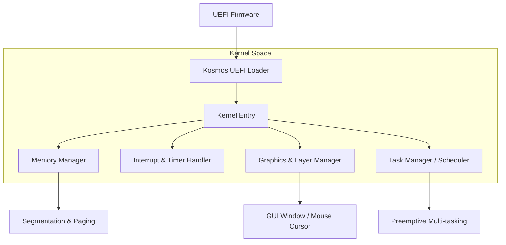

# 🌌 KosmOS: From-Scratch 64-bit Operating System
**KosmOS**는 UEFI 부트로더부터 커널 핵심 서브시스템까지 직접 구현한 64비트 OS입니다.  
단순한 이론 학습을 넘어, **운영체제를 바닥부터 직접 만들어 보며** 시스템의 본질적인 동작 원리를 파악하는 것을 목표로 합니다.

> **Note**: 본 프로젝트는 'MikanOS'를 참고하여 구현 중입니다.

---
## 🏗 아키텍처 (Architecture)

---
## 🛠 해결한 문제 (Problem Solving)
### 1. 하드웨어 독립적인 타이머 정밀도 확보
- **문제**: CPU마다 LAPIC 타이머의 주파수가 달라 `sleep()` 함수의 정확도가 일정하지 않은 이슈가 발생했습니다.
- **사고**: 모든 환경에서 동일하게 동작하는 고정 주파수 기준점이 필요하다고 판단했습니다.
- **해결**: 고정 주파수를 가진 **ACPI PM 타이머**를 소스로 활용하여,  
부팅 시 LAPIC 타이머를 동적으로 실측 및 보정하는 로직을 구현해 정밀한 시분할을 달성했습니다.

### 2. 인터럽트 처리와 GUI 렌더링 간 경합(Race Condition) 해결
- **문제**: 마우스 인터럽트와 윈도우 그리기 작업이 동시에 발생할 때 화면이 깨지거나 시스템이 중단되는 현상이 있었습니다.
- **사고**: GUI 렌더링은 원자적(Atomic)이지 않으므로, 하드웨어 이벤트와 렌더링 로직을 분리해야 한다고 생각했습니다.
- **해결**: 인터럽트 핸들러에서는 이벤트를 **메시지 큐**에 삽입만 하고,  
메인 루프에서 순차적으로 레이어를 업데이트하도록 구조를 변경하여 안정성을 확보했습니다.

### 3. 효율적인 메모리 관리
- **문제**: 표준 라이브러리 없이 4GB 이상의 메모리 영역을 파편화 없이 관리해야 했습니다.
- **사고**: 성능과 단순함의 균형을 위해, 페이지 단위의 직관적인 할당 방식이 적합하다고 보았습니다.
- **해결**: **비트맵(Bitmap)** 방식의 할당자를 구현하여 특정 영역의 점유 상태를 상수로 조회/수정할 수 있게 했으며,  
이를 통해 메모리 부족 상황에 대한 예외 처리를 정교화했습니다.

---
## ✨ 주요 기능 (Key Features)
- **전용 UEFI 부트 로더**: ELF64 커널 적재 및 GOP 프레임버퍼 정보 전달.
- **레이어 기반 윈도우 시스템**: 독립 레이어 관리 및 실시간 마우스/창 GUI 지원.
- **xHCI USB 드라이버**: USB 3.0 컨트롤러 제어를 통한 HID 장치 입력 처리.
- **선점형 멀티태스킹**: 10ms 단위의 시분할 태스크 스위칭 프로토콜.

---
## 🛠 기술 스택 (Tech Stack)
- **Languages**: C++17, x86_64 Assembly, C
- **Boot**: UEFI (EDK2) / **Arch**: x86_64
- **Tools**: LLVM/Clang, Makefile, QEMU

---
## 🔮 향후 계획 (Next Steps)
- **파일 시스템**: FAT32 연동 및 파일 IO 구현.
- **네트워크**: 기본적인 TCP/IP 프로토콜 확장.
- **시스템 콜**: 사용자 모드 전환 및 인터페이스 구축.

---
## 🛠 빌드 및 실행
1. **Loader**: `cd KosmosLoaderPkg && build`
2. **Kernel**: `cd kernel && make`
3. **QEMU**: `./tools/run_qemu.sh`

---
